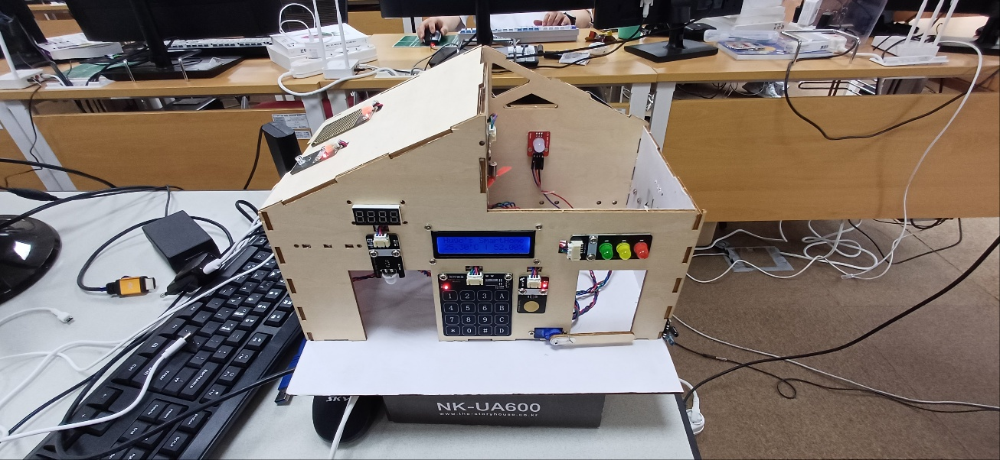
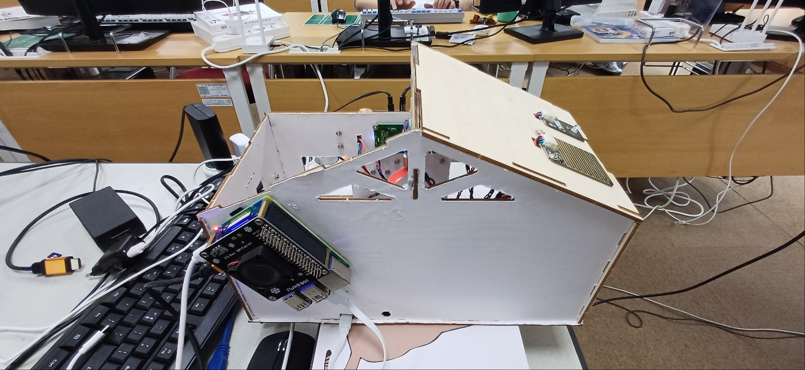
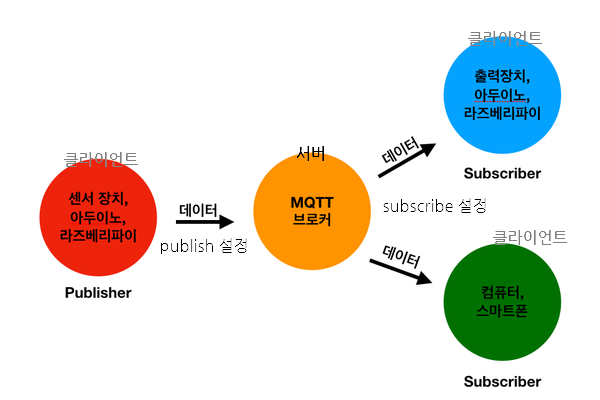

# IoT-smarthome
스마트홈 연동 모니터링앱

## 1일차

### 스마트홈 연동 모니터링앱



- 전면부



- 후면부

- [개발링크](https://github.com/hugoMGSung/hungout-with-arduino/tree/main/SmartHomeDIY)

1. Arduino + Raspberry Pi 스마트홈 기제작

#### MQTT



- Message Queueing Telemetry Transport : 기계간 통신용 경량 메시징 프로토콜
- Publish / Subscribe 라는 출판쪽 용어로 사용
    - Publish(출간) : 메시지 만들어서 전달
    - Subscribe(구독) : 필요한 메시지를 수신받아서 사용
- Server(MQTT 브로커)/Client 프로그램으로 동작
- 데이터는 휘발성 : 받는 사람이 없으면 데이터는 사라짐. DB에 저장하는 구성을 해줘야 함

- MQTT를 대체할 수 있는 유사한 기능을 하는 기술
    - `Redis`, `Apache Kafka`, *RabbitMQ*, ZeroMQ, Socket통신 직접개발

#### MQTT 시뮬레이션 프로젝트 시작
1. MQTT 브로커 설치
    - https://mosquitto.org/
    - mosquitto-2.0.21a-install-windows-x64.exe 설치
    - 설치 후 서비스에서 서비스 중지
2. Mosquitto 설정파일 수정
    - mosquitto.conf 문서에디터 관리자모드로 오픈
    - #listener -> listener 1883 으로 변경
    - #allow_anonymous false -> allow_anonymous true
    - 파일 저장 후, 서비스 재시작
3. Windows 보안
    - 방화벽 및 네트워크 보호 > 고급 설정
    - 인바운드 규칙 > 새 규칙
    - 포트 선택 > 다음
    - TCP 선택, 특정포트 1883 입력
4. MQTT Explorer 설치
    - new Connection 생성, Host 127.0.0.1, Port 1883 저장
    - CONNECT
5. VS Code에서 [MqttPub.py](./day08/Pythons/MqttPub.py) 파일 생성

https://github.com/user-attachments/assets/c6beab73-7d4f-4a3a-aea0-8706390005c0

### 스마트홈 프로젝트 시작
1. 화면 UI 변경
2. NuGet 패키지
    - CommunityToolkit.Mvvm 설치
3. Models, Views, ViewModels 폴더 생성
4. MainWindow 바인딩 처리
5. MainViewModel에서 바인딩 속성 초기화

    
    
    
## 2일차 

### 스마트홈 연동 모니터링앱 (계속)
- MQTT 부터 시작

#### 네트워크 확인
- telnet 명령어로 서버서비스가 동작중인지 확인
- telnet 아이피주소 포트번호

    ```shell
    # MySQL에 접속가능한지 여부
    > telnet 127.0.0.1 3306
    # MQTT에 접속가능한지 여부
    > telnet 127.0.0.1 1883
    ```

#### MQTT 시뮬레이션 (계속)
1. MqttPub.py 소스코드에 Fake IoT 센서값 전달 코딩
2. Fake 센싱값을 json으로 Publish
3. C# MahApps.Metro 사용 MQTT 데이터 Subscriber앱
    - CommunityToolkit.Mvvm
    - MahApps.Metro
    - MahApps.Metro.IconPacks
    - Newtonsoft.Json
    - MQTTnet
    - MySql.Data

4. DB서버에 접속자 정보확인 쿼리
    ```sql
    SELECT * FROM information_schema.processlist limit 10; -- 데이터가 10건 이상이면 LIMIT 10은 삭제
    ```

5. WPF MVVM 전체 구현
6. MqqtPub.py 와 Publish된 IoT데이터 WPF에서 Subscribe 예제

https://github.com/user-attachments/assets/bb14b3e7-f52d-4d4c-8ad1-01aaca9c38bc

## 3일차

### 스마트홈 연동 모니터링앱(계속)

#### 스마트홈 기기 실제 IoT센서데이터 모니터링앱
- 2일차 작성한 MQTT Subscribe 앱
- SmartHome MQTT Json Key값
    - L : Light 전등
    - R : Rain (Water Drop Sensor)
    - T : Temperture 온도
    - H : Humidity 습도
    - F : Fan 선풍기/에어컨
    - V : Human Detection 침입감지
    - RL : Real Light 실제 전등 켜짐 여부
    - CB : ChaimBell 벨푸시 여부

- 실행화면 생략 (2일차 화면 동일)

#### 스마트홈 WPF 실시간 시각화
- NuGet 패키지
    - MQTTnet
    - Newtonsoft.Json
    - NLog
- WpfMqttSubApp.Models의 SensingInfo.cs 가져오기
- MQTT 센서 데이터로 동작용 변수 값 할달
- 실행화면

    https://github.com/user-attachments/assets/6620096d-e3da-4974-9e83-bdfc55531844
  
    스마트홈 조작 영상

    https://github.com/user-attachments/assets/8f0b7e33-c5df-4108-91d3-750a2183fb3e

    스마트홈 모니터링앱 동작영상

### Github 대문 꾸미기
